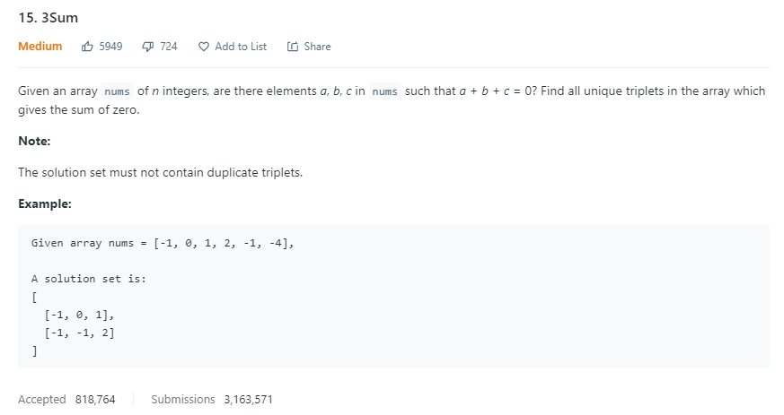
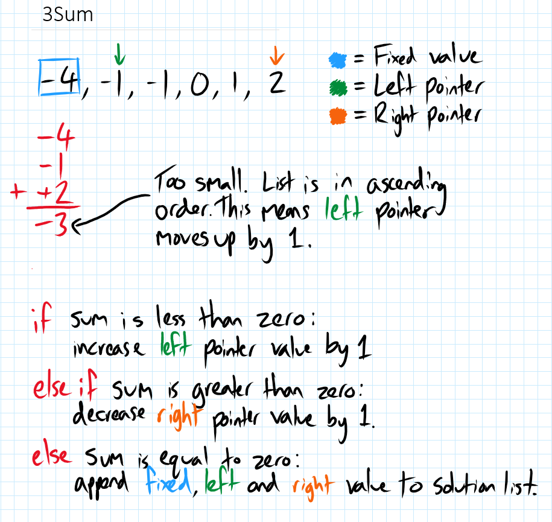

This was very interesting problem. Inititially I planned on having 3 pointers which would attempt to find a solution through brute force by iterating through all values in the list and only adding triplets that weren't already in the solutions. However this solution would be inefficient and time consuming. Eventually I settled on the solution below which entails a fixed value for each loop that iterates through the list and then left and right pointers that change one at a time depending on whether the sum is higher or lower than 0. 

NOTE: print() functions were added for debugging, to identify on which line/s the script is failing.

