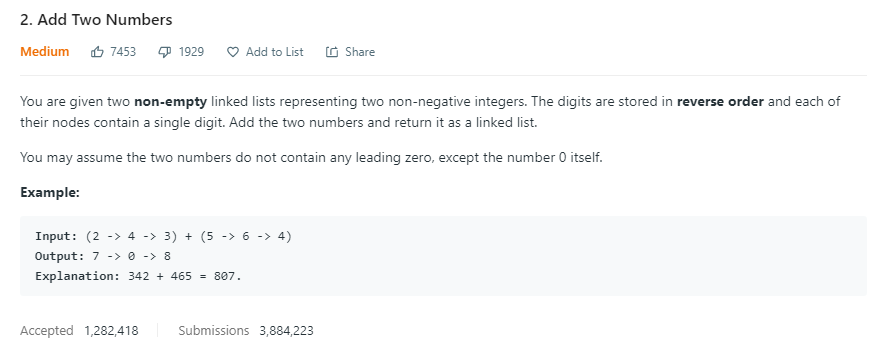
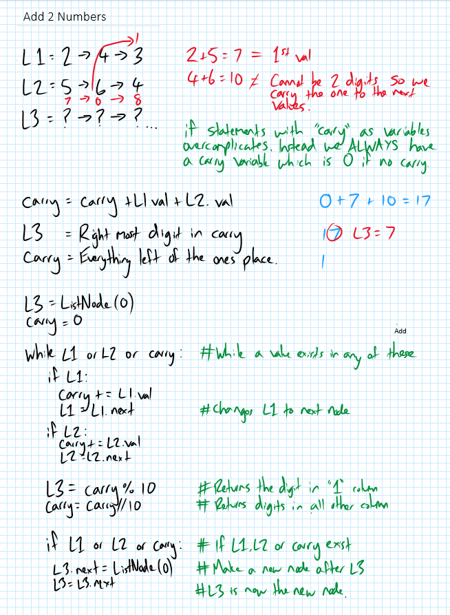

This solution entailed learning about Linked Lists. I tried many different solutions including having an "if statement" to create a carry variable when addition of the 2 numbers results in a number with more than 1 digit. Eventually I settled on always having a carry variable with a default value of 0. 

NOTE: print() functions were added for debugging, to identify on which line/s the script is failing. 

